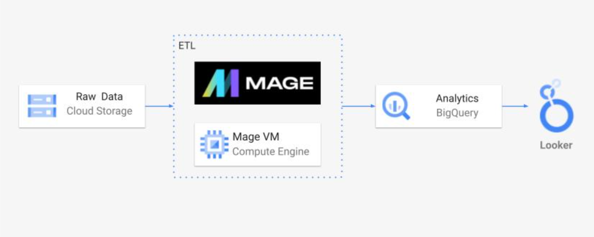
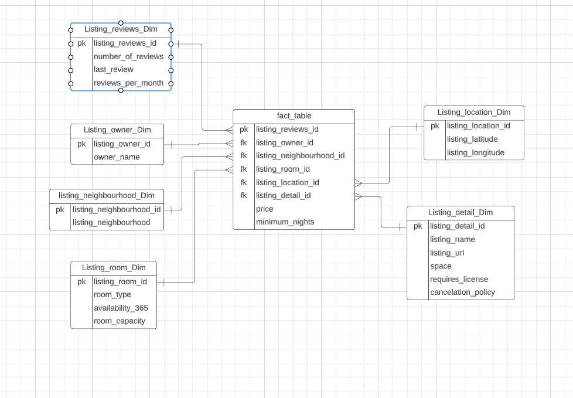
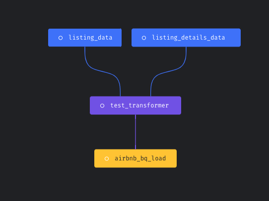

# Airbnb-Amsterdam-DataEngineering- GCP Project

## Introduction

The goal of this project is to perform data analytics on Airbnb Amsterdam data using various tools and technologies, including GCP Storage, Python, Compute Instance, Mage Data Pipeline Tool, BigQuery, and Looker Studio.

## Architecture 

## Technology Used
- Programming Language - Python

Google Cloud Platform
1. Google Storage
2. Compute Instance 
3. BigQuery
4. Looker Studio

Modern Data Pipeine Tool - https://www.mage.ai/

Contibute to this open source project - https://github.com/mage-ai/mage-ai

## Dataset Used

Airbnb-Amsterdam dataset from kaggle

The dataset consisted of many different csv files, I mereged the data and used the data accordingly. The majorly useddata files in this data modelling are listing.csv and listing_details.csv

Here is the dataset used - https://www.kaggle.com/datasets/erikbruin/airbnb-amsterdam?select=listings.csv

More info about dataset can be found Website - https://www.kaggle.com/datasets/erikbruin/airbnb-amsterdam

## Data Model

## Data Pipeline

